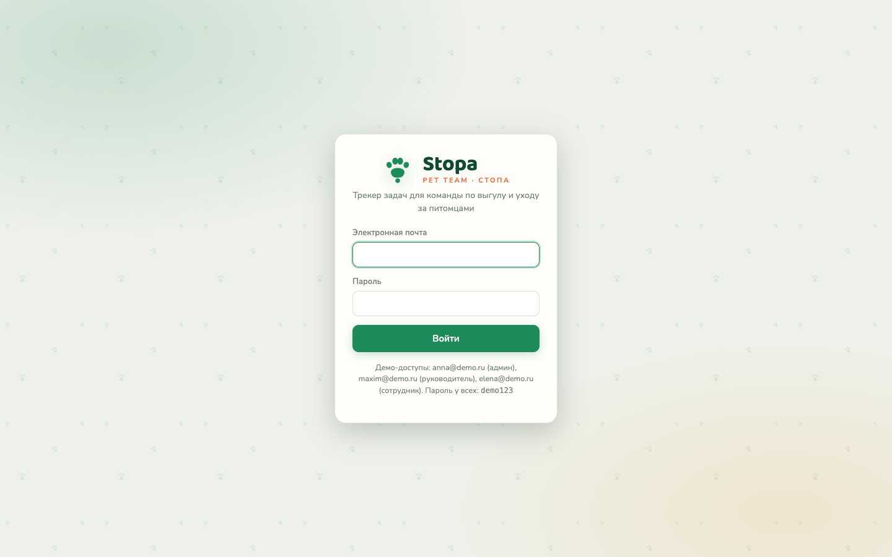
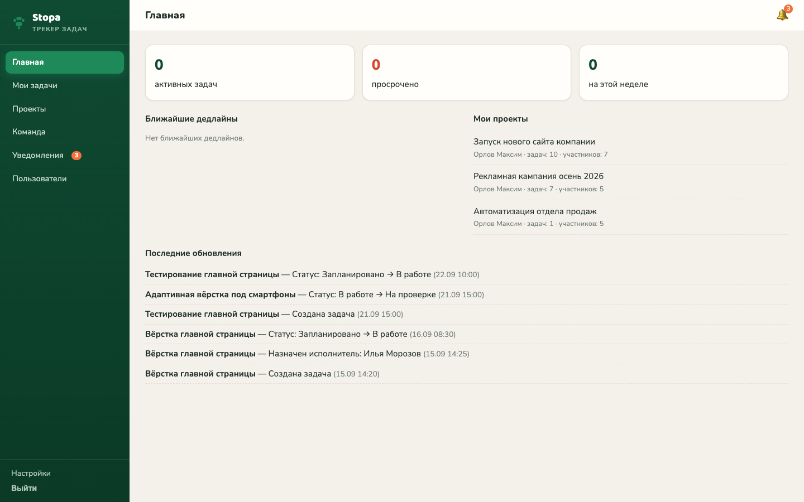
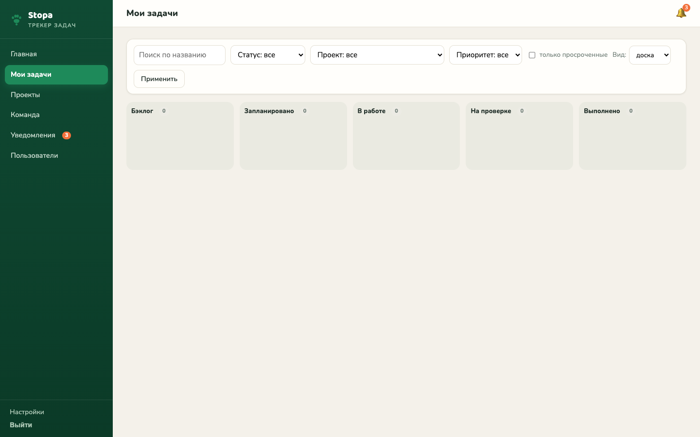
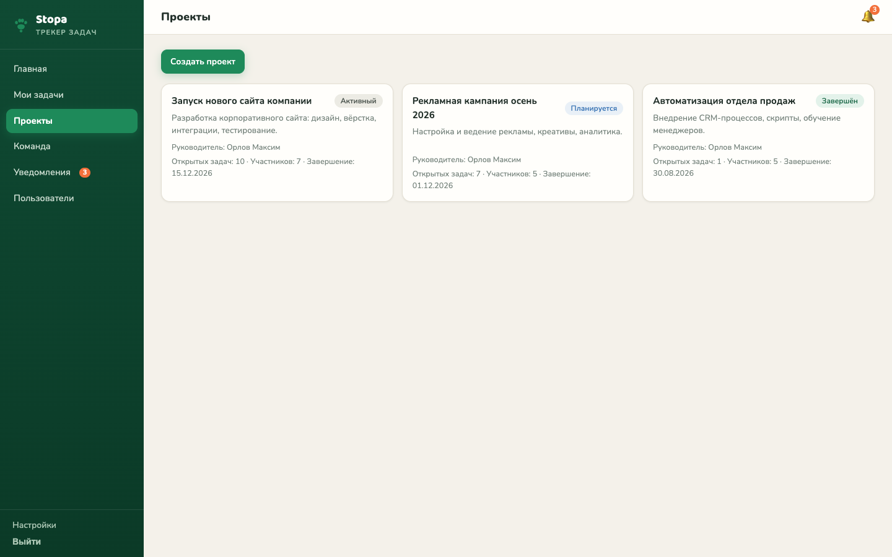
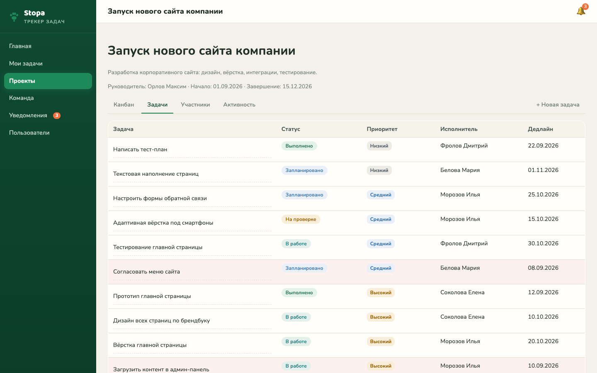
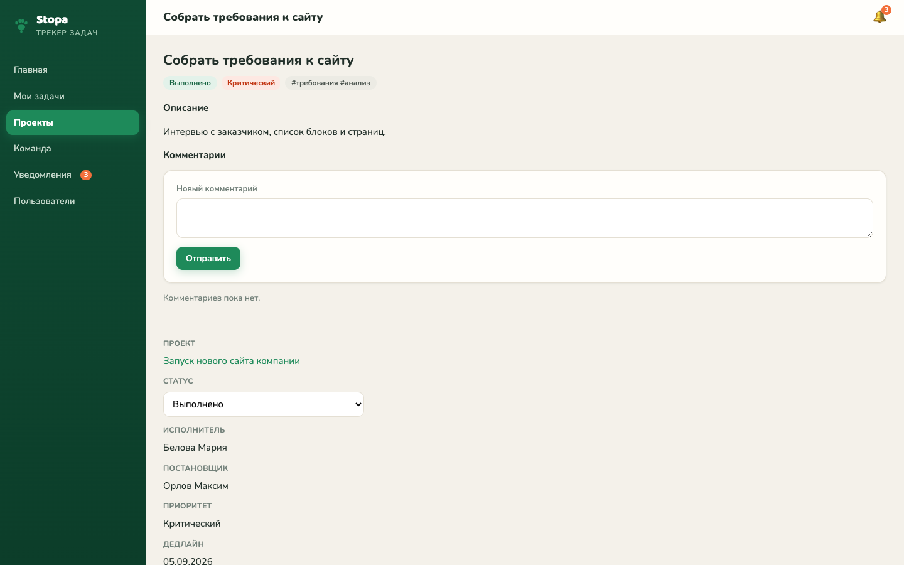
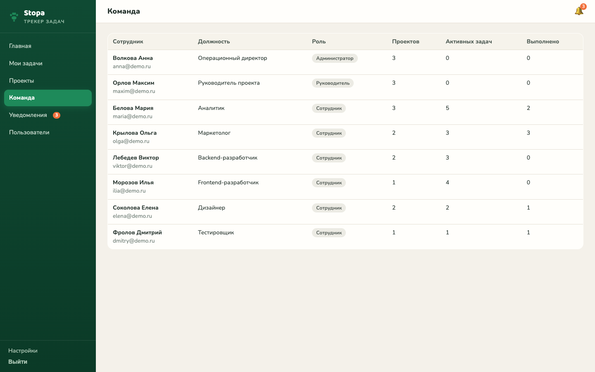

# Stopa · Tracker_01 — трекер задач для команды по уходу за питомцами

> **Live Demo**: [https://tracker-01.gonka.blog/](https://tracker-01.gonka.blog/)  
> **Репозиторий**: [https://github.com/textsmen-design/tracker-01](https://github.com/textsmen-design/tracker-01)  
> **Статус приёмочных тестов**: 14/14 PASS (`doc/test_report.md`)

Полнофункциональный веб-трекер задач на чистом стеке **PHP + MySQL** с фирменной айдентикой **Stopa** (знак «лапа», природная палитра Trail Green / Warm Coral / Warm Sand, шрифты Baloo 2 + Nunito). Проект разработан для автоматизации сервисной службы выгула, передержки и ухода за домашними животными.

---

## 🎯 Какую проблему решает

В небольших сервисных командах задачи часто теряются в мессенджерах, срываются дедлайны выгула и кормления, а у руководителя нет прозрачной картины занятости сотрудников. При этом внедрение корпоративных систем (Jira, YouGile, Asana) избыточно сложно и требует постоянной платной подписки.

**Stopa** решает эту проблему «под ключ»:
- Даёт единую точку контроля задач команды без абонентской платы;
- Наглядно визуализирует этапы работы через канбан-доску;
- Разделяет зоны ответственности и права доступа сотрудников;
- Подсвечивает срочные и просроченные поручения;
- Работает прямо в браузере любого смартфона или ноутбука.

---

## 👥 Для кого сделан проект

- **Малый сервисный бизнес**: службы выгула, дрессировки и передержки питомцев, локальные клининговые и сервисные службы;
- **Руководители команд**: которым необходим прозрачный контроль сроков и распределение исполнителей;
- **Сотрудники и исполнители**: которым нужен простой рабочий список своих задач на день без визуального шума.

---

## ✨ Ключевые возможности

- 🔐 **Ролевая модель (3 роли)**:
  - **Администратор**: полный доступ ко всем проектам, задачам, управлению пользователями и настройкам;
  - **Руководитель**: создание проектов, постановка задач, контроль исполнения и смена статусов;
  - **Сотрудник**: фокус на своих задачах, смена статусов по канбану, комментарии и отчёты.
  - Безопасность: сессионная авторизация, хэширование паролей (`PASSWORD_DEFAULT`), CSRF-токены для POST-запросов.
- 📋 **Интерактивный Канбан (5 колонок)**:
  - Колонки: `Бэклог` → `Запланировано` → `В работе` → `На проверке` → `Готово`;
  - Перетаскивание карточек задач через native HTML5 Drag & Drop с сохранением статуса в БД через AJAX.
- ⏱ **Управление задачами**:
  - Приоритеты (низкий, средний, высокий, срочный), дедлайны с автоматическим выделением просроченных задач;
  - Фильтрация по проектам, исполнителям, приоритетам и текстовый поиск.
- 💬 **Коммуникация и аудит**:
  - Комментарии к карточкам задач с поддержкой внешних ссылок-вложений;
  - Прозрачная история изменений (кто, когда и какое поле изменил).
- 🔔 **Внутренние уведомления**:
  - Индикатор-колокольчик и бейдж непрочитанных событий в шапке интерфейса.
- 📱 **Адаптивный интерфейс**:
  - Полная поддержка тач-устройств и смартфонов с тёмным фирменным мобильным меню.

---

## 🛠 Технологический стек

- **Backend**: Чистый PHP 8.3 (без сторонних тяжёлых фреймворков, чистая модульная архитектура: роутер, сервисы, контроллеры, хелперы);
- **База данных**: MySQL 8.0 / MariaDB 10.4 (10 связанных таблиц, внешние ключи, транзакции, индексы);
- **Frontend**: Семантический HTML5, чистый CSS3 (CSS Variables, Flexbox, Grid), чистый Vanilla JavaScript (Drag & Drop API, Fetch API);
- **Инфраструктура**: Linux VDS (Ubuntu), веб-сервер Nginx, SSL-сертификат Let's Encrypt, Git;
- **Типографика и стиль**: Google Fonts (Baloo 2, Nunito), фирменная дизайн-система Stopa.

---

## 📸 Скриншоты интерфейса

### 1. Экран авторизации (айдентика Stopa)


### 2. Главная панель администратора


### 3. Интерактивная Канбан-доска (5 колонок с Drag & Drop)


### 4. Список проектов команды


### 5. Список задач проекта с фильтрацией


### 6. Детальная карточка задачи (дедлайны, комментарии, история)


### 7. Управление участниками команды и ролями


---

## 🚀 Как запустить локально

### Требования
- PHP 8.1+
- MySQL 8.0+ или MariaDB 10.4+

### Шаги установки

1. **Клонировать репозиторий**:
   ```bash
   git clone https://github.com/textsmen-design/tracker-01.git
   cd tracker-01
   ```

2. **Инициализировать базу данных**:
   ```bash
   mysql -u root < db/schema.sql
   mysql -u root simple_tasks < db/demo_data.sql
   ```

3. **Запустить встроенный веб-сервер**:
   ```bash
   php -S 127.0.0.1:8080 -t app/public
   ```
   Откройте в браузере: `http://127.0.0.1:8080`

> **Для пользователей macOS**: В репозитории есть готовый скрипт автоматического запуска окружения:  
> `./scripts/start_dev.sh`

### Тестовые учётные записи для входа
Пароль для всех аккаунтов: **`demo123`**

| Роль | Email | Назначение |
|---|---|---|
| **Администратор** | `anna@demo.ru` | Полный доступ ко всем модулям, проектам и пользователям |
| **Руководитель** | `maxim@demo.ru` | Создание проектов, постановка задач команде |
| **Сотрудник** | `elena@demo.ru` | Просмотр назначенных задач, работа с канбаном |

---

## 📂 Структура проекта

```text
app/
  public/         # Точка входа веб-сервера (index.php) и статика (assets/css, js, img)
  src/            # Ядро: подключение к БД, auth, permissions, роуты и страницы
  views/          # Шаблоны представлений (layout, login, dashboard, kanban, task)
db/
  schema.sql      # Структура базы данных MySQL
  demo_data.sql   # Демонстрационный набор данных
doc/
  test_report.md  # Отчёт о прохождении приёмочного тестирования (14/14 PASS)
  screenshots/    # Архив рабочих скриншотов
docs/
  screenshots/    # Витринные брендированные скриншоты для README
info/
  tz.md           # Техническое задание проекта
  brandbook.md    # Фирменная айдентика Stopa
scripts/
  start_dev.sh    # Скрипт быстрого локального запуска
```

---

## 📄 Лицензия и статус

Проект выполнен в рамках портфолио разработки цифровых продуктов. Айдентика Stopa разработана специально для демонстрационного кейса. Все тесты соответствия ТЗ успешно пройдены.